## TDOS浏览器概述

&nbsp;&nbsp;&nbsp;&nbsp;&nbsp;&nbsp;TDOS浏览器包含四大模块，分别是主页、区块、事务、合约。在浏览器首页展示了TDOS的一些基本数据，通过不同的条件查询可以跳转到相应事务的详情页。

## TDOS浏览器使用说明
（1）主页

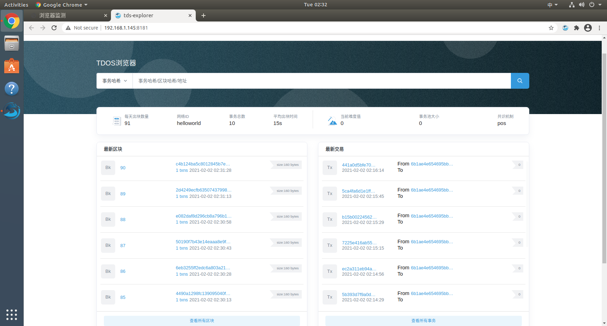

&nbsp;&nbsp;&nbsp;&nbsp;&nbsp;&nbsp;在主页搜索框内可以根据事务哈希、区块哈希和地址进行查询，分别可以跳转到区块详情、事务详情和查询地址对应的交易列表详情。

&nbsp;&nbsp;&nbsp;&nbsp;&nbsp;&nbsp;主页展示TDOS基本数据，包括每天出块数量、事务总数、平均出块时间、当前难度值、事务池大小及共识机制。

&nbsp;&nbsp;&nbsp;&nbsp;&nbsp;&nbsp;显示最新的10个区块和10个交易，查看所有区块和查看所有事务两个按钮点击后分别跳转到区块列表页面和事务列表页面。

（2）区块

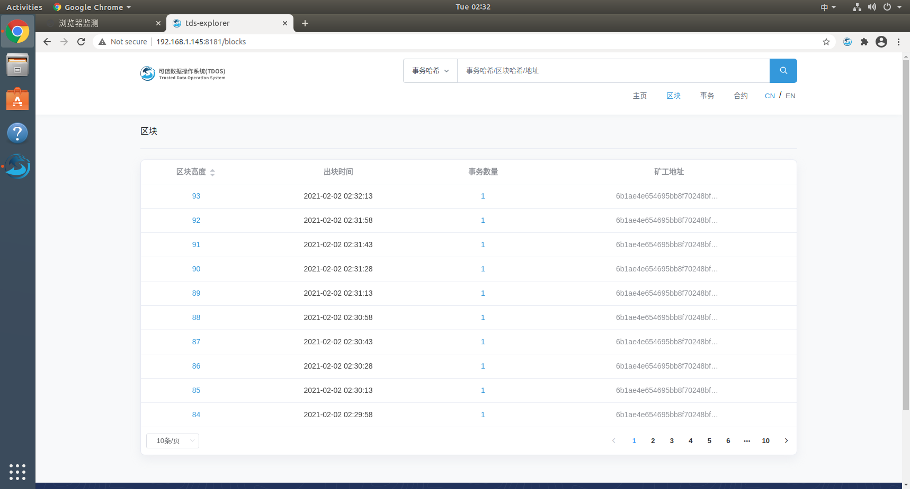

&nbsp;&nbsp;&nbsp;&nbsp;&nbsp;&nbsp;在区块模块的搜索框内可以根据事务哈希、区块哈希和地址进行查询，分别可以跳转到区块详情、事务详情和查询地址对应的交易列表详情。

&nbsp;&nbsp;&nbsp;&nbsp;&nbsp;&nbsp;区块列表展示支持分页，高度降序排序，展示数据为区块高度、出块时间、事务数量、矿工地址。

&nbsp;&nbsp;&nbsp;&nbsp;&nbsp;&nbsp;点击区块高度进入区块详情的界面如下：

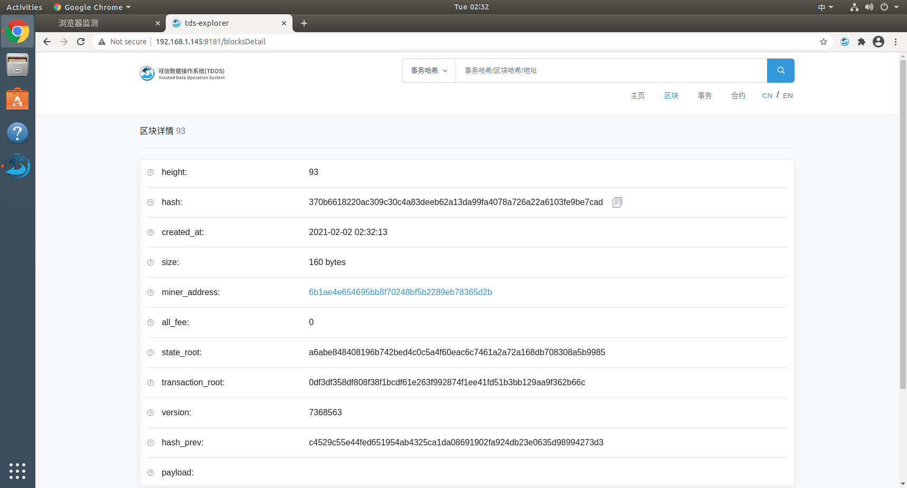

&nbsp;&nbsp;&nbsp;&nbsp;&nbsp;&nbsp;点击事务数量进入事务详情的界面如下：

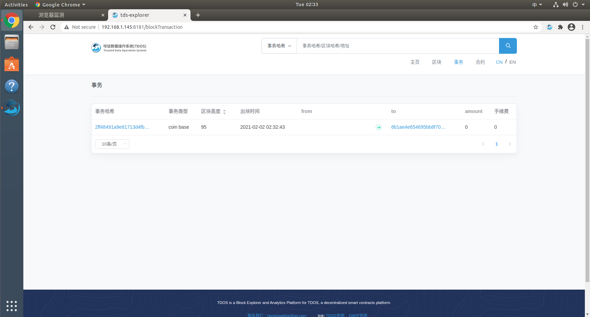

&nbsp;&nbsp;&nbsp;&nbsp;&nbsp;&nbsp;显示事务hash、事务类型、区块高度、出块时间、from和to地址、amount、手续费

（3）事务

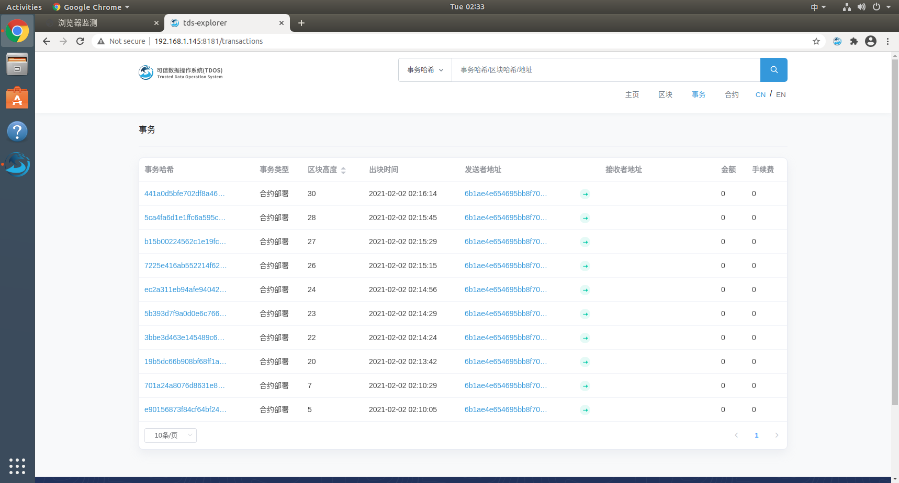

&nbsp;&nbsp;&nbsp;&nbsp;&nbsp;&nbsp;事务列表展示可分页，区块高度降序排序，事务显示事务哈希、事务类型、区块高度、出块时间、发送者和接收者地址、金额和手续费。、

&nbsp;&nbsp;&nbsp;&nbsp;&nbsp;&nbsp;点击事务哈希，展示事务详情，如下界面所示：

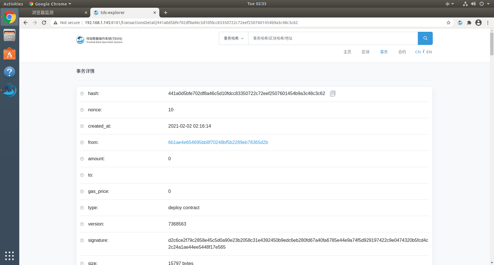

&nbsp;&nbsp;&nbsp;&nbsp;&nbsp;&nbsp;点击发送者地址或者接收者地址，则显示该地址的当前nonce值、当前余额及该地址下的事务列表。

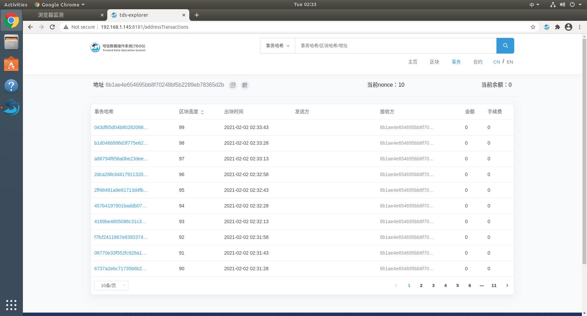

（4）合约

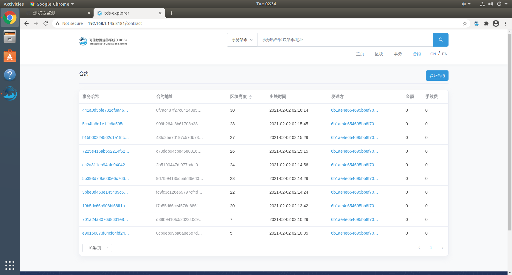

&nbsp;&nbsp;&nbsp;&nbsp;&nbsp;&nbsp;展示部署的事务合约列表，可分页，区块高度降序排序，展示参数有事务哈希、合约地址、区块高度、出块时间、from、amount、手续费。

&nbsp;&nbsp;&nbsp;&nbsp;&nbsp;&nbsp;点击事务哈希，进入合约详情界面，如下图所示：

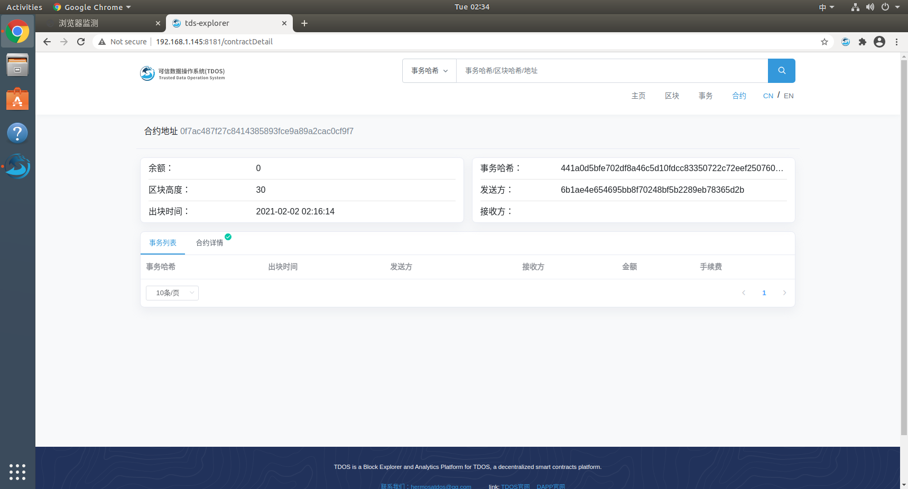

&nbsp;&nbsp;&nbsp;&nbsp;&nbsp;&nbsp;上面显示事务的详情数据。展示数据为：合约地址、余额、事务哈希，区块高度、区块时间、from、to

&nbsp;&nbsp;&nbsp;&nbsp;&nbsp;&nbsp;下面展示调用该合约事务的列表+合约详情

&nbsp;&nbsp;&nbsp;&nbsp;&nbsp;&nbsp;A、调用合约事务，区块高度降序排序，支持分页，展示参数有事务hash、出块时间、from、to、amount和手续费。事务hash、from和to可跳转到对应页面

&nbsp;&nbsp;&nbsp;&nbsp;&nbsp;&nbsp;B、合约详情，参考图如下：

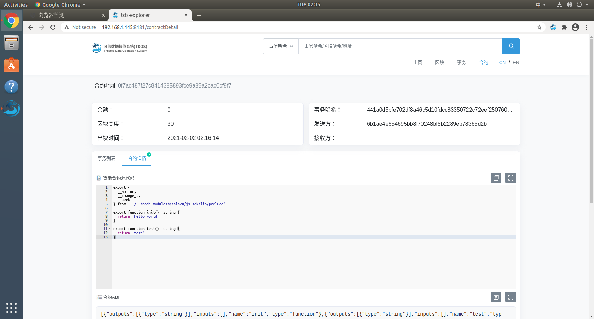

&nbsp;&nbsp;&nbsp;&nbsp;&nbsp;&nbsp;参数有：智能合约源代码、合约ABI和payload，如果合约没有上传验证就显示空

&nbsp;&nbsp;&nbsp;&nbsp;&nbsp;&nbsp; 增加一按钮，Verify Contract（验证合约），用于上传自定义合约代码的

1、点击后显示验证页面，该页面需要输入两个参数，第一个是合约的地址，第二个是输入合约的源代码，参考如下图

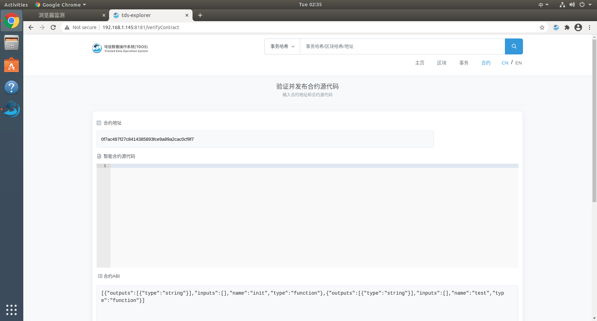

&nbsp;&nbsp;&nbsp;&nbsp;&nbsp;&nbsp;点击验证合约按钮展示下图页面，用于上传自定义合约代码，该页面需要输入两个参数，第一个是合约的地址，第二个是输入合约的源代码，参考如下图

&nbsp;&nbsp;&nbsp;&nbsp;&nbsp;&nbsp;输入合约地址，系统会自动生成合约ABI和构造函数字节码，再输入合约源代码，点击验证并发布，如下图所示。

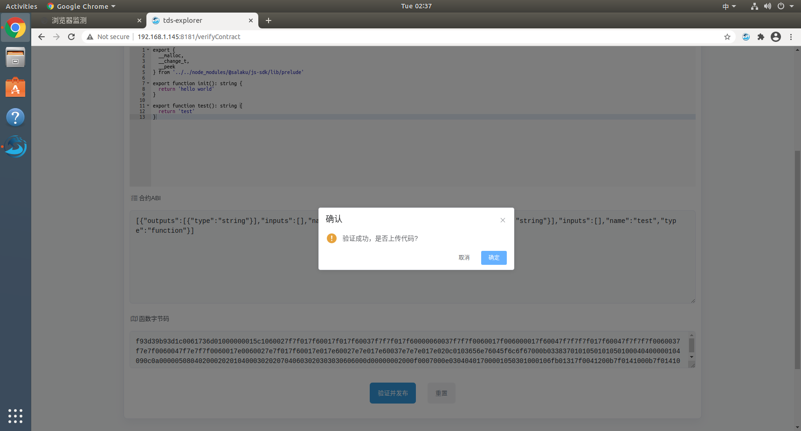