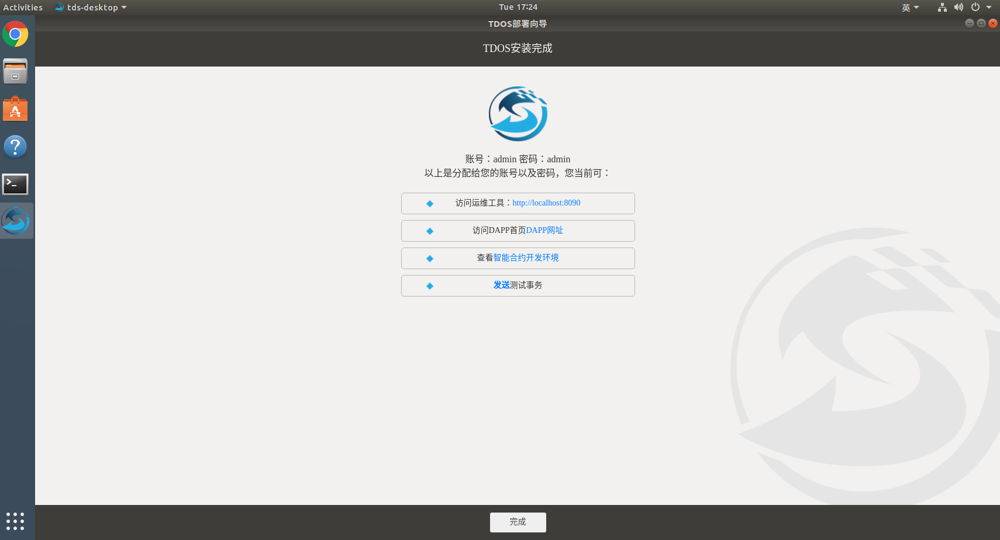
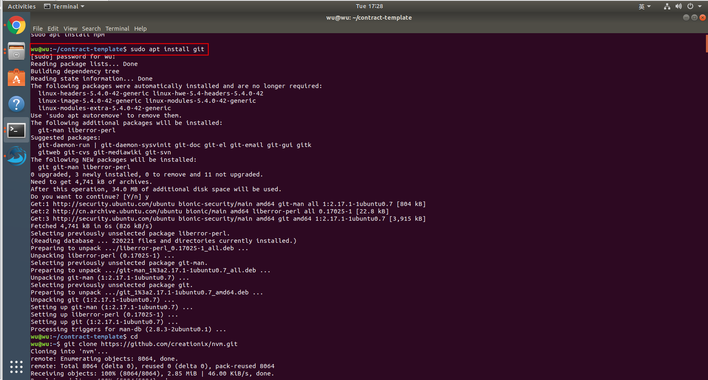
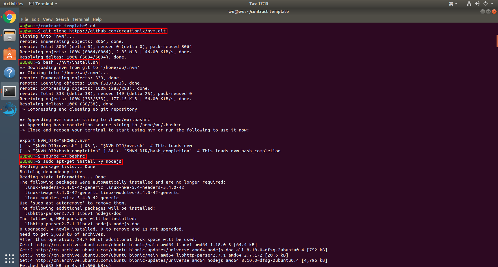
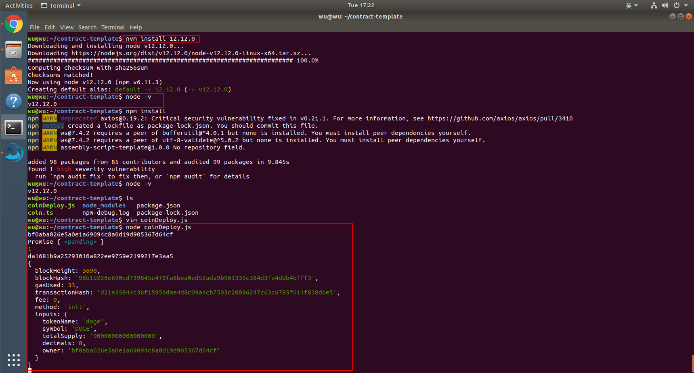
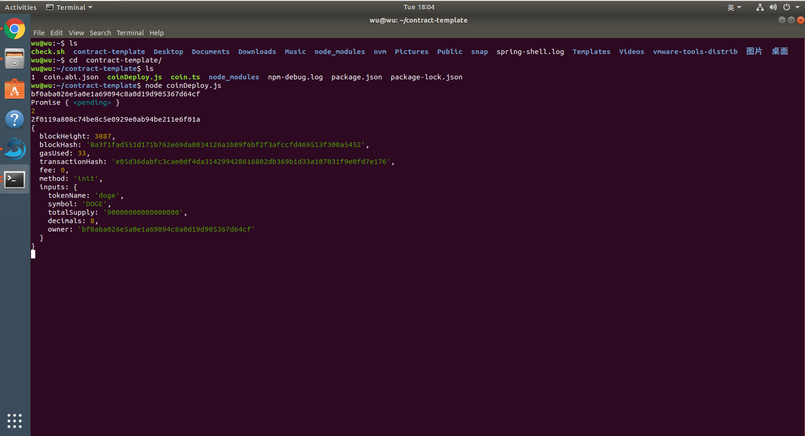
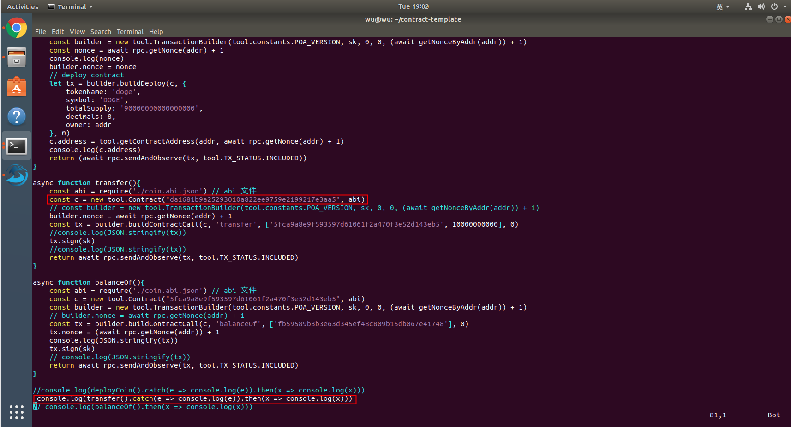
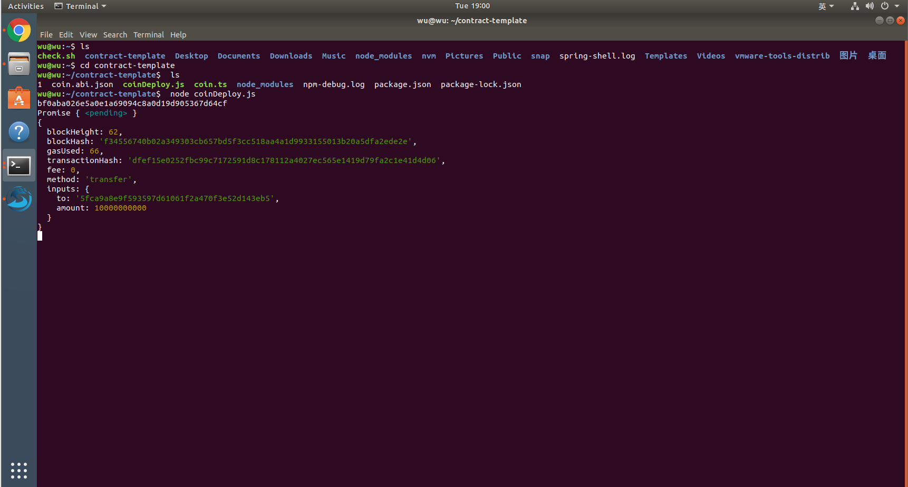

## 简介

&nbsp;&nbsp;&nbsp;&nbsp;&nbsp;&nbsp;TDOS智能合约开发工具旨在指导具备一定开发能力的人员来开发智能合约。
    
## 使用说明

1、TDOS安装完成以后，如下图所示：



2、点击查看智能合约开发环境，跳转contract-template目录下，右击鼠标，打开终端，安装git，在命令行输入：sudo apt install git ，回车；

&nbsp;&nbsp;&nbsp;&nbsp;&nbsp;&nbsp;输入TDOS系统登陆密码，回车；

&nbsp;&nbsp;&nbsp;&nbsp;&nbsp;&nbsp;遇到Do you want to continue? 输入y,回车。



3、下载nvm，在命令行输入：`Git clone https://github.com/creationix/nvm.git` ，回车，下载时间略长，请耐心等待；

&nbsp;&nbsp;&nbsp;&nbsp;&nbsp;&nbsp;安装nvm，在命令行输入bash ./nvm/install.sh；

&nbsp;&nbsp;&nbsp;&nbsp;&nbsp;&nbsp;启用nvm，在命令行输入source ~/.bashrc。



4、安装node.js，在命令行输入sudo apt-get install -y nodejs；

&nbsp;&nbsp;&nbsp;&nbsp;&nbsp;&nbsp;在命令行输入node -v 查看node版本，node版本必须大于且包含12；

&nbsp;&nbsp;&nbsp;&nbsp;&nbsp;&nbsp;安装依赖,在命令行输入npm install；

&nbsp;&nbsp;&nbsp;&nbsp;&nbsp;&nbsp;依赖安装好之后，就可以部署或者调用编写好的智能合约。




5、下面是一个智能合约的例子，首先需要编写一个智能合约，通过命令vim  coin.ts编辑代码，coin智能合约的代码如下：

```
/**
 * erc 20 example in assembly script
 */

export { __change_t, __malloc, __peek } from './node_modules/@salaku/js-sdk/lib' // 区块链应用程序接口
import { Util, U256, Globals, ABI_DATA_TYPE } from './node_modules/@salaku/js-sdk/lib'
import { Store } from './node_modules/@salaku/js-sdk/lib'
import { Context, Address } from './node_modules/@salaku/js-sdk/lib'

const _balance = Store.from<Address, U256>('balance');
const _freeze = Store.from<Address, U256>('freeze');

export function init(tokenName: string, symbol: string, totalSupply: U256, decimals: u64, owner: Address): void {
    // tokenName || symbol || totalSupply || decimals || owner
    Globals.set<string>('tokenName', tokenName);
    Globals.set<string>('symbol', symbol);
    Globals.set<U256>('totalSupply', totalSupply);
    Globals.set<u64>('decimals', decimals);
    Globals.set<Address>('owner', owner);
    _balance.set(owner, totalSupply);
}

// display balance
export function balanceOf(addr: Address): U256 {
    return _balance.getOrDefault(addr, U256.ZERO);
}


/* Send coins */
export function transfer(to: Address, amount: U256): void {
    const msg = Context.msg();
    assert(amount > U256.ZERO, 'amount is not positive');
    let b = balanceOf(msg.sender)
    assert(b >= amount, 'balance is not enough');
    _balance.set(to, balanceOf(to) + amount);
    _balance.set(msg.sender, balanceOf(msg.sender) - amount);
}

```

6、部署和调用合约的文件coinDeploy.js代码如下：

```
const tool = require('@salaku/js-sdk')
const fs = require('fs')

// 读取配置
const sk = 'b01bb4ceb384ceee3b1eaf2ed78deba989ed92b25c75f28de58fa8bba191d7bc'
const pk = tool.privateKey2PublicKey(sk)
const addr = tool.publicKey2Address(pk)
console.log(addr)

// const contract = new tool.Contract('', require('./assembly/index.abi.json'))
//
// 事务构造工具
// const builder = new tool.TransactionBuilder(tool.constants.POA_VERSION, sk, 0, 200000)

// rpc 工具
// const rpc = new tool.RPC('192.168.1.52', 7010)
const rpc = new tool.RPC('localhost', 7010)
const ascPath = 'node_modules/.bin/asc';

const contract = new tool.Contract()

// 事务构造工具
// const builder = new tool.TransactionBuilder(tool.constants.POA_VERSION, sk, 0, 200000)

// get nonce by addr
async function getNonceByAddr(addr){
    return rpc.getNonce(addr)
}

async function deployCoin(){
    // contract.binary = await tool.compileContract(ascPath, 'coin.ts', { debug: true })
    // contract.abi = require('./coin.abi.json')
    const buf = await tool.compileContract(ascPath, 'coin.ts')
    const abi = tool.compileABI(fs.readFileSync('coin.ts'))
    fs.writeFileSync('coin.abi.json', JSON.stringify(abi))
    const c = new tool.Contract('', abi, buf)
    const builder = new tool.TransactionBuilder(tool.constants.POA_VERSION, sk, 0, 0, (await getNonceByAddr(addr)) + 1)
    const nonce = await rpc.getNonce(addr) + 1
    console.log(nonce)
    builder.nonce = nonce
    // deploy contract
    let tx = builder.buildDeploy(c, {
        tokenName: 'doge',
        symbol: 'DOGE',
        totalSupply: '90000000000000000',
        decimals: 8,
        owner: addr
    }, 0)
    c.address = tool.getContractAddress(addr, await rpc.getNonce(addr) + 1)
    console.log(c.address)
    return (await rpc.sendAndObserve(tx, tool.TX_STATUS.INCLUDED))
}

async function transfer(){
    const abi = require('./coin.abi.json') // abi 文件
    const c = new tool.Contract("5fca9a8e9f593597d61061f2a470f3e52d143eb5", abi)
    builder.nonce = await rpc.getNonce(addr) + 1
    const tx = builder.buildContractCall(c, 'transfer', ['fb59589b3b3e63d345ef48c809b15db067e41748', 10000000000], 0)
    console.log(JSON.stringify(tx))
    tx.sign(sk)
    console.log(JSON.stringify(tx))
    return await rpc.sendAndObserve(tx, tool.TX_STATUS.INCLUDED)
}

async function balanceOf(){
    const abi = require('./coin.abi.json') // abi 文件
    const c = new tool.Contract("5fca9a8e9f593597d61061f2a470f3e52d143eb5", abi)
    // builder.nonce = await rpc.getNonce(addr) + 1
    const tx = builder.buildContractCall(c, 'balanceOf', ['fb59589b3b3e63d345ef48c809b15db067e41748'], 0)
    tx.nonce = (await rpc.getNonce(addr)) + 1
    console.log(JSON.stringify(tx))
    tx.sign(sk)
    // console.log(JSON.stringify(tx))
    return await rpc.sendAndObserve(tx, tool.TX_STATUS.INCLUDED)
}

console.log(deployCoin().catch(e => console.log(e)).then(x => console.log(x)))
// console.log(transfer().then(x => console.log(x)))
// console.log(balanceOf().then(x => console.log(x)))


```

7、部署合约成功后返回两个地址，owner为所有者地址，另一个地址为合约地址，响应结果如下：



8、调用合约的时候需要把部署合约返回的合约地址填到常量 c 的位置，注释掉部署事务，打开转账事务。



9、调用合约及响应结果如下：

