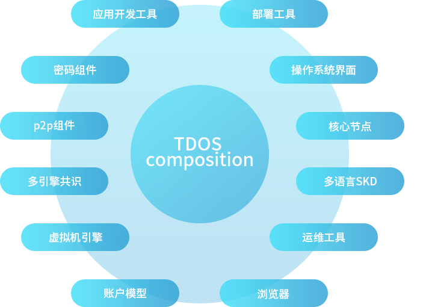
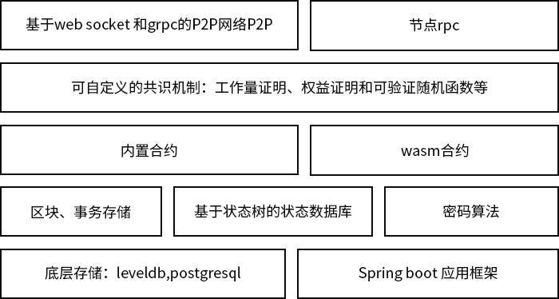

## TDOS核心简介

- ### TDOS产品矩阵介绍


## 产品架构



&#160;&#160;&#160;&#160;&#160;&#160;如图所示，产品为 5 层，由下至上依次是存储层、数据层、协议层、共识层和合约层、网络层。

&#160;&#160;&#160;&#160;&#160;&#160;其中存储层主要用于存储账户数据及区块链元数据，存储技术主要使用文件系统、LevelDB和关系型数据库。

&#160;&#160;&#160;&#160;&#160;&#160;数据层主要用于处理交易中的各类数据，如将数据打包成区块，将区块维护成链式结构，区块中内容的加密与哈希计算，区块内容的数字签名及增加时间戳印记，将交易数据构建成 Merkle 树，并计算 Merkle 树根节点的 hash 值等。

&#160;&#160;&#160;&#160;&#160;&#160;区块链网络也是基于 P2P 网络的，在网络中每个节点既有客户端角色，又有服务端角色。

&#160;&#160;&#160;&#160;&#160;&#160;合约层分为两部分，一部分是 LotusVM(即虚拟机)，用户部署的智能合约代码运行在 LotusVM 中。智能合约是运行在以太坊上的代码的统称，一个智能合约往往包含数据和代码两部分。智能合约系统将约定或合同代码化，由特定事件驱动触发执行。因此，在原理上适用于对安全性、信任性、长期性的约定或合同场景。在以太坊系统中，智能合约的默认编程语言是 TypeScript，一般学过 JavaScript 语言的读者很容易上手TypeScript。另一部分是系统内置合约，用户可以通过引入自定的jar包覆盖系统内置合约，无需部署编译即可加载，甚至可以通过改写系统内置合约实现自定义的共识机制。

## SDK使用

### java-sdk

详见：
https://github.com/TrustedDataFramework/tds-sdk.git

### js-sdk

详见：
https://github.com/TrustedDataFramework/js-sdk.git

## 部署启动

### 参数说明
```
sunflower:
    assert: 'false' # 是否开启断言，默认是 false
    validate: 'false' # 启动时是否校验本地数据，如果设置为true，启动时会校验账本数据
    libs: 'local/jar' # jar包路径，用于加载外部的共识插件
    secret-store: "" # 证书的路径，若填写，节点启动后会打印出一个公钥并且进入阻塞，用户通过工具生成证书文件保存到这个路径后，节点会成功加载证书
```
### 启动步骤
1.安装jdk，版本要求在8以上 
http://openjdk.java.net/install/

2.下载好打包好的 jar 文件，名称为
sunflower-core-0.0.1-SNAPSHOT.jar

3.在命令行输入
```
java -jar sunflower-core-0.0.1-SNAPSHOT.jar
```
 
### 启动说明

&#160;&#160;&#160;&#160;&#160;&#160;TDS 采用 yml 文件作为参数配置文件，可以在启动时用环境变量SPRING_CONFIG_LOCATION 指定好自定义的配置文件。 例如:
```
export SUNFLOWER_CONFIG_LOCATION=$HOME/Documents/local0.yml,$HOME/Documents/local1.yml
java -jar sunflower*.jar
```

&#160;&#160;&#160;&#160;&#160;&#160;文件路径之间以逗号分割，后面的配置会覆盖前面的配置。 除了环境变量配置，也可以用命令行参数指定配置文件，例如

```
java -jar sunflower*.jar --spring.config.location=$HOME/Documents/local0.yml
```

&#160;&#160;&#160;&#160;&#160;&#160;配置文件中的参数都可以用相应的命令函参数覆盖， 例如配置文件中的配置项 spring.datasource.url 可以在启动时用命令行参数覆盖。
```
java -jar sunflower*.jar --spring.datasource.url="jdbc:h2:mem:test"
```

### 编码格式
&#160;&#160;&#160;&#160;&#160;&#160;递归前缀编码(RLP)：https://github.com/ethereum/wiki/wiki/RLP 一种二进制序列化规范，优点是紧凑，缺点是最大只支持对4G以下的内容进行编解码。

&#160;&#160;&#160;&#160;&#160;&#160;java 可以采用注解的方式进行 rlp 编码和解码：https://github.com/TrustedDataFramework/java-rlp

&#160;&#160;&#160;&#160;&#160;&#160;javascript 或 nodejs 中使用 rlp 编码可参考 https://github.com/ethereumjs/rlp

## 区块结构

### 区块头


| 字段名     |   类型   | 说明 |
| ---- | ---- | ---- |
| version | int | 区块版本号 PoA=1634693120,PoW=7368567,PoS=7368563 |
| hashPrev    |   bytes   | 父区块的哈希值 |
|    transactionsRoot  |   bytes   | 事务的梅克尔根 |
| stateRoot | bytes | 状态树树根 |
| height | long | 区块高度 |
| createdAt | long | 区块的构造时间，用 unix epoch 秒数表示 |
| payload | bytes | 载荷，根据不同的共识具有不同的含义|
| hash | bytes | 区块的哈希值 |

### 区块体
&#160;&#160;&#160;&#160;&#160;&#160;区块体包含了多个事务，事务分为两类：

&#160;&#160;&#160;&#160;&#160;&#160;1.coinbase事务，是矿工节点自动生成的事务，该事务里面包含了出块者的公钥哈希和出块奖励，在一个区块体中，永远排序在第一，且该类型只有一个；

&#160;&#160;&#160;&#160;&#160;&#160;2.其他事务，这是公链中广播的事务，由用户构建相应事务并广播在p2p网络中，矿工节点在出块时获取事务内存池中的事务并打包进区块。

&#160;&#160;&#160;&#160;&#160;&#160;3.矿工节点在打包时如果没有其他事务，区块体中只有coinbase事务，该区块简称空块，如果不想出空块，可参见共识参数。

### 梅克尔树
&#160;&#160;&#160;&#160;&#160;&#160;梅克尔树通常包含区块体的底层（交易）数据库，区块头的根哈希值（即Merkle根）以及所有沿底层区块数据到根哈希的分支。梅克尔树运算过程一般是将区块的数据进行分组哈希，并将生成的哈希值插入到梅克尔树中，如此递归直到只剩最后一个根哈希值并记为区块头的Merkle根。

&#160;&#160;&#160;&#160;&#160;&#160;区块体中是事务的梅克尔根。

### payload 的具体含义

&#160;&#160;&#160;&#160;&#160;&#160;1. 对于 PoA 共识，节点在构造区块完成后会对区块整体做一个签名，然后把签名放到区块头的 payload 字段中

&#160;&#160;&#160;&#160;&#160;&#160;2. PoW 共识的区块头 payload 相当于比特币区块头的 nonce，用于工作量证明

&#160;&#160;&#160;&#160;&#160;&#160;3. PoS 的区块头 payload 字段为空

## 事务

### 事务结构


| 字段名     |   类型   | 说明 |
| ---- | ---- | ---- |
| version | int | 事务版本号 PoA=1634693120,PoW=7368567,PoS=7368563 |
| type    |   int   | 0=COINBASE,1=转账,2=合约部署,3=合约调用|
|  createdAt  |   long   | 事务的构造时间，用 unix epoch 秒数表示 |
| nonce | long | 事务的序号，coinbase事务的 nonce 等于区块高度 |
| from| bytes | 事务发送者的公钥 |
| gasPrice | long | 事务的手续费价格 |
| amount | long | 转账、后者在合约调用时的转账金额|
| payload | bytes | 载荷 |
| to | bytes |  转账的接收者或者被调用的合约|
| signature | bytes | 签名 |
| hash | bytes | 事务哈希 |


### amount 的不同含义

1. 对于 coinbase 事务，amount 是经济奖励的数量
2. 对于转账事务，amount 是转账的数量
3. 对于合约部署的事务，amount 必须为 0 
4. 对于合约调用的事务，amount 的金额会被转到合约的创建者的账户下

### payload 的不同含义

1. coinbase 事务和 转账事务的 payload 一般为空，特别的是 PoA 共识的 payload 填写的是出块者的公钥
2. 对于合约部署事务，payload 包含了智能合约 wasm 字节码、合约的 ABI 和构造器参数等。
3. 对于合约调用事务，payload 是调用智能合约的二进制参数，需要通过 sdk 构造

## 账户模型

###  账户结构

&#160;&#160;&#160;&#160;&#160;&#160;普通账户与合约账户都用以下结构表示


| 字段名     |   类型   | 说明 |
| ---- | ---- | ---- |
| address | bytes | 账户地址，二十个字节 |
| nonce |   long   | 递增序号 |
|  balance  |   long   | 账户余额，对于合约账户此字段永远为0 |
| createdBy | bytes | 合约的创建者，普通账户此字段为空 |
| contractHash | bytes | 合约代码的哈希值，普通账户此字段为空 |
| storageRoot | bytes | 合约存储树树根，普通账户此字段为空 |


### 普通账户

&#160;&#160;&#160;&#160;&#160;&#160;普通账户的地址由公钥计算得到。
普通账号可以用椭圆曲线密钥对表示，包含公钥和私钥，默认采用的椭圆曲线是sm2。


&#160;&#160;&#160;&#160;&#160;&#160;普通账户的地址生成是对公钥作一次哈希值计算后，取公钥的后面20个字节，伪代码如下：

```nodejs
h = sm3(publicKey)
address = h[len(h) - 20:]
```

&#160;&#160;&#160;&#160;&#160;&#160;nonce 用于防止重放攻击，当用普通账户构造事务时，需要保证事务的 nonce 等于当前账户的nonce 加一，用伪代码可以这样表示：

```nodejs
nonce = getNonce(publicKey)
transaction['type'] = 1 # 这里用的是转账事务，也可以 2或者3
transaction['from'] = publicKey
transaction['nonce'] = nonce + 1
```

&#160;&#160;&#160;&#160;&#160;&#160;balance 是账户的余额

### 合约账户

&#160;&#160;&#160;&#160;&#160;&#160;合约账户是普通账户部署合约时生成的，合约地址的生成用伪代码表示:

```nodejs
b = sm3(rlp.encode([publicKey, nonce]))
address = h[len(b) - 20:]
```

&#160;&#160;&#160;&#160;&#160;&#160;合约地址是把 合约部署者的公钥和部署合约事务的 nonce 作了 rlp 编码后，计算哈希值，然后取最后 20 个字节

&#160;&#160;&#160;&#160;&#160;&#160;合约账户没有对应的私钥和公钥，合约账户的 nonce 值等于部署合约事务的 nonce，而且这个nonce不会再改变

&#160;&#160;&#160;&#160;&#160;&#160;每个合约账户都有自己独立的存储空间，这个存储空间实际上是一个梅克尔-帕特里夏树，合约账户的状态可以用梅克尔-帕特里夏树的树根表示，也就是 storageRoot 字段

## 共识机制

### 简介
&#160;&#160;&#160;&#160;&#160;&#160;共识引擎是区块链的引擎，维系着区块链世界的正常运转。共识算法就是为了达到共同认识所涉及的算法，它主要解决多点统一意见的问题。 常见的共识算法 有PoW(工作量证明)，PoS(股权证明)，VRF(可验证随机函数)等。

&#160;&#160;&#160;&#160;&#160;&#160;区块链的共识机制，其实就是自治生态系统内部生产关系的演变，其演变方式和人类历史进程有诸多相似。

&#160;&#160;&#160;&#160;&#160;&#160;原始社会，人类是以部落形式构成的，没有阶级，没有剥削，没有压迫，劳动成果的分配是多劳多得，对应的是比特币的POW共识机制——工作量证明机制。

&#160;&#160;&#160;&#160;&#160;&#160;捕猎能力越强的人，能有更高的生存几率，在部落里也会拥有更多的决定权。这里对应的机制为PoW，工作量证明机制，就是工作越多，收益越大，越有决定权。

&#160;&#160;&#160;&#160;&#160;&#160;随着部落人越来越多，生产力水平的逐步提高，出现产品的剩余之后，就出现了贫富分化，原先的共识机制也被破坏，而被阶级社会所取代，而形成了最初的国家。

&#160;&#160;&#160;&#160;&#160;&#160;这时对应的共识机制就是POS，权益证明机制，拥有的资产越多，决定权就越高，国家的利益与权利集中于皇权贵族。

&#160;&#160;&#160;&#160;&#160;&#160;但POS会带来马太效应，强者越强，弱者越弱，开始有一批人觉醒产生了新的思想，并且开始反抗，革命，对应现在的资本主义国家与社会主义国家。

&#160;&#160;&#160;&#160;&#160;&#160;对应的共识机制也演变成了DPoS，委托权益证明。由人民群众投票推选出代表，代表民众实行决定权，就像西方国家议会制度，中国的人民代表大会制度。

&#160;&#160;&#160;&#160;&#160;&#160;PoW和PoS是目前公有链最常用的共识机制，但是PoW和PoS在系统的处理能力上不足。主要体现在两个方面：一是区块速度不够快，例如比特币平均10分钟出一个区块，以太坊平均15s出一个区块；二是，每个区块的交易容量有限，例如比特币的区块大小在1M左右，大概能够包括2000笔交易。

### 共识类型
&#160;&#160;&#160;&#160;&#160;&#160;TDOS支持POA、POS和POW。（后续会持续更新）

#### POA
##### POA 参数    

```yml
sunflower:
  consensus:
    name: 'poa' # 选择 poa 作为共识机制
    genesis: 'genesis/poa.jsonc' # 创世区块的 url，搜索优先级是 网路 > 文件系统 > classpath 
    block-interval: '1' # 出块间隔，最小值是一秒
    enable-mining: 'true' # 是否开启挖矿
    private-key: 'f00df601a78147ffe0b84de1dffbebed2a6ea965becd5d0bd7faf54f1f29c6b5' # 节点的私钥明文，建议使用环境变量的方式加载
    allow-empty-block: 'false' # 是否允许空块
    max-body-size: '2048' # 区块的最大事务数量限制
```

##### PoA的创世区块文件

```jsonc
{
  "parentHash": "0x0000000000000000000000000000000000000000000000000000000000000000", // 父区块的哈希值

  "timestamp": 1572511433, // 区块时间戳

  // 被允许出块的账户地址
  "miners": [{
      "addr": "9cbf30db111483e4b84e77ca0e39378fd7605e1b"
    },
    {
      "addr": "9cbf30db111483e4b84e77ca0e39378fd7605e1b"
    }

  ],

  // 预分配的账户余额
  "alloc":{
        "9cbf30db111483e4b84e77ca0e39378fd7605e1b": 1000000,
        "bf0aba026e5a0e1a69094c8a0d19d905367d64cf": 1000000
  }
}
```
##### POA的加入和退出

&#160;&#160;&#160;&#160;&#160;&#160;权威证明共识（又称PoA共识）规定，节点只有被授权以后才能参与区块链共识，也只有被授权的节点能加入 p2p 网络

&#160;&#160;&#160;&#160;&#160;&#160;poa 共识对应的创世区块中，miners 包含了所有被授权节点的公钥，只有拥有对应私钥的节点才可以加入 p2p 网络并参与共识

&#160;&#160;&#160;&#160;&#160;&#160;在 PoA 共识中有两个特殊的内置合约地址， 一个是 0000000000000000000000000000000000000003 和 0000000000000000000000000000000000000004。这两个内置合约分别保存了 p2p 许可的节点和被授权参与共识的节点。其他节点如果想加入 p2p 网络，需要构造请求事务发到相应的内置合约上面。

&#160;&#160;&#160;&#160;&#160;&#160;以加入 p2p 网络为例，流程如下：

&#160;&#160;&#160;&#160;&#160;&#160;1、节点 B 试图加入 p2p 网络，于是构造了如下事务发到了已经受到许可的节点A上
```json
{
    "version": 1634693120,
    "type": 3,
    "createdAt": "2020-07-29T07:16:40Z",
    "nonce": 1,
    "from": "节点B的公钥",
    "gasPrice": 0,
    "amount": 0,
    "payload": "00", 
    "to": "0000000000000000000000000000000000000003",
    "signature": "****",
    "hash": "**"
}
```  
&#160;&#160;&#160;&#160;&#160;&#160;2、节点A通过查看合约状态，收到了节点B的请求，并且同意了节点B的加入，构造了以下事务发到链上
```json
{
    "version": 1634693120,
    "type": 3,
    "createdAt": "2020-07-29T07:16:40Z",
    "nonce": 1,
    "from": "节点A的公钥",
    "gasPrice": 0,
    "amount": 0,
    "payload": "01拼接上节点A的地址" , 
    "to": "0000000000000000000000000000000000000003",
    "signature": "****",
    "hash": "**"
}
```
&#160;&#160;&#160;&#160;&#160;&#160;3、节点A通过了节点B的请求后，因为原先只有节点A处在授权节点中，所以满足了超过2/3同意的条件，节点B加入了 p2p 许可节点。若节点C再要加入 p2p 网络，则必须节点A和节点B都同意才可以，因为此时若只有节点A同意，没有满足 2/3 以上的同意。

#### POS

##### POS参数 (PoS)

```yml
sunflower:
  consensus:
    name: 'pos' # 选择 pos 作为共识机制
    genesis: 'genesis/pos.jsonc' # 创世区块的 url，搜索优先级是 网路 > 文件系统 > classpath 
    block-interval: '5' # 出块间隔，最小值是一秒
    enable-mining: 'true' # 是否开启挖矿
    allow-empty-block: 'true' # 是否出空块
    max-body-size: '2048' # 区块的最大事务数量限制
    max-miners: '10' #最大矿工数量
    miner-coin-base: '9cbf30db111483e4b84e77ca0e39378fd7605e1b' # 矿工收益地址
```


##### PoS的创世区块文件

```jsonc
{
  "parentHash": "0x0000000000000000000000000000000000000000000000000000000000000000", // 父区块的哈希值

  "timestamp": 1572511433, // 区块时间戳
  "miners": [{
      // 矿工 = 地址 + 投票数量
      "addr": "9cbf30db111483e4b84e77ca0e39378fd7605e1b",
      "vote": 100000000
    }
  ],

// 预分配的账户余额
  "alloc":{
        "9cbf30db111483e4b84e77ca0e39378fd7605e1b": 1000000,
        "bf0aba026e5a0e1a69094c8a0d19d905367d64cf": 1000000
  }
}
```
##### POS的加入和退出
&#160;&#160;&#160;&#160;&#160;&#160;PoS 即 Proof of Stake。在 PoS 共识中，股权较大的节点拥有区块打包权。这里的PoS使用内置合约保存每个账号收到的投票数量，地址是0000000000000000000000000000000000000005。

&#160;&#160;&#160;&#160;&#160;&#160;在这个内置合约中每个账号被按照投票数量排序，假设sunflower.consensus.max-miners=10，则投票排名前10的账户会获得区块打包权。

&#160;&#160;&#160;&#160;&#160;&#160;与 PoS 相关的事务有投票事务和取消投票的事务

1、投票事务

假设节点A给节点B投 1000 票，则节点A需要构造如下事务
```json
{
    "version": 7368563,
    "type": 3,
    "createdAt": "2020-07-29T07:16:40Z",
    "nonce": 1,
    "from": "节点A的公钥",
    "gasPrice": 0,
    "amount": 1000,
    "payload": "00拼接上节点B的地址" , 
    "to": "0000000000000000000000000000000000000005",
    "signature": "****",
    "hash": "**"
}
```

2、撤回投票事务

假设节点A要撤回给节点B的投票，需要构造如下事务
```json
{
    "version": 7368563,
    "type": 3,
    "createdAt": "2020-07-29T07:16:40Z",
    "nonce": 1,
    "from": "节点A的公钥",
    "gasPrice": 0,
    "amount": 0,
    "payload": "01拼接上投票事务的哈希值" ,
    "to": "0000000000000000000000000000000000000005",
    "signature": "****",
    "hash": "**"
}
```
3、节点A只有撤回给B的投票后才能重新投票
#### POW
##### POW 参数
```yml
sunflower:
  consensus:
    name: 'pow' # 选择 pow 作为共识机制
    genesis: 'genesis/pow.jsonc' # 创世区块的 url，搜索优先级是 网路 > 文件系统 > classpath 
    block-interval: '30' # 出块间隔，最小值是一秒，
    enable-mining: 'true' # 是否开启挖矿
    blocks-per-era: '100' # 每隔多少个区块调整一次难度值
    allow-empty-block: 'true' # 是否出空块
    max-body-size: '2048' # 区块的最大事务数量限制
    miner-coin-base: '9cbf30db111483e4b84e77ca0e39378fd7605e1b' # 矿工收益地址
```
##### PoW的创世区块文件

```json
{
  "parentHash": "0x0000000000000000000000000000000000000000000000000000000000000000", // 父区块的哈希值


  "timestamp": 1572511433, // 区块时间戳

  "nbits": "0000ffffffffffffffffffffffffffffffffffffffffffffffffffffffffffff", // 初始难度值

  // 预分配的账户余额
  "alloc":{
        "9cbf30db111483e4b84e77ca0e39378fd7605e1b": 1000000,
        "bf0aba026e5a0e1a69094c8a0d19d905367d64cf": 1000000
  }
}
```
##### POW机制
&#160;&#160;&#160;&#160;&#160;&#160;PoW 即工作量证明，优先解决哈希值难题的矿工可获得区块打包权，工作量证明用伪代码表示如下：
```
while True:
  r = randbytes(32) # 生成随机 payload
  block['payload'] = r
  digest = hash(block)
  if digest < nbits: 
    # 完成了工作量证明
    break
```
&#160;&#160;&#160;&#160;&#160;&#160;这里的 PoW 使用内置合约保存难度值，该内置合约的地址为 0000000000000000000000000000000000000002，难度值会随时调整，不像比特币一样把难度值保存在区块头中。

&#160;&#160;&#160;&#160;&#160;&#160;PoW没有对 p2p 作出限制，也没有限制矿工的数量，只要能优先解决哈希值难题的矿工就可以获得区块打包权。

## P2P网络

&#160;&#160;&#160;&#160;&#160;&#160;P2P网络基于 grpc 或者 websocket,两者都是二进制协议，都支持长连接。

### 参数配置
```
sunflower:
  p2p:
    name: 'websocket' # P2P消息传输采用的协议，默认是websocket, gRPC 是可选项
    max-peers: '16' # 邻居节点的最大数量限制，默认是16个
    
    # 节点的地址，端口可以不填，默认监听端口是30569
    # 如果主机名填localhost或者127.0.0.1，程序首先会尝试获取节点的公网ip，若公网ip加上端口号可以ping通，程序会把公网ip+端口作为对外地址。
    # 如果公网ip获取失败或者公网ip+端口无法ping通，程序会获取本机在局域网中的ip，将局域网的ip作为自己的对外地址
    address: 'node://localhost:7000' 

    # 是否开启节点发现，若不开启节点发现，邻居节点固定为种子节点和信任节点
    # 若开启节点发现，邻居节点会动态变化，但信任节点不会被主动断开。    
    enable-discovery: 'true' 
    
    # 种子节点
    bootstraps:
      - 'node://192.168.1.117:9999'

    # 信任节点的地址
    trusted:
      - 'node://192.168.1.117:9999'


    # 白名单配置，可以填写其他节点的公钥，如果白名单中填写了至少一个公钥，黑名单将无效，只有白名单中的节点才可以被连接
    white-list:
    	- '02b507fe1afd0cc7a525488292beadbe9f143784de44f8bc1c991636509fd50936'


    # 黑名单配置，可以填写其他节点的公钥，如果某个节点的公钥在黑名单中，它的消息将不会被接收
    blocked-list:
    	- '02b507fe1afd0cc7a525488292beadbe9f143784de44f8bc1c991636509fd50936'

    # 用明文设置节点p2p的私钥，建议用证书文件加载私钥
    private-key: 'f00df601a78147ffe0b84de1dffbebed2a6ea965becd5d0bd7faf54f1f29c6b5'

    # 是否持久化邻居节点信息，默认是false 
    # 如果设置为 true 且 database.type 不是 memory 节点信息会被持久化到文件 database.directory/peers.json
    persist: false

    # 节点发现检查频率，默认是15秒一次
    discover-rate: 15

    # p2p 最大包大小，协议会对超过这个大小的包进行分包传输 详见 p2p 章节
    max-packet-size: 2097152

    # 每隔 300 秒对收到的分包数据进行清理，详见 p2p 章节
    cache-expired-after: 300
```

### 消息结构

&#160;&#160;&#160;&#160;&#160;&#160;p2p 消息的序列化和反序列化基于 protobuf

| 字段名     |   类型   | 说明 |
| ---- | ---- | ---- |
| <div style="width:70pt">code</div>  | <div style="width:30pt">int</div> | NOTHING=0,PING=1,PONG=2,LOOKUP=3,PEERS=4,ANOTHER=5,DISCONNECT=6,MULTI_PART=7 |
| created_at    |   int   | 消息发送的时间戳 |
|    remote_peer  |   string   | 消息的发送者的uri |
| ttl | int | 每当消息被转发一次，ttl会减1，防止消息被无限次转发 |
| nonce| int | 递增随机数，防止出现哈希值相同的消息 |
|signature| bytes | 消息发送者对消息整体的签名，用于防止消息内容被篡改 |
| data | bytes | 消息体，具体内容取决于 code|


&#160;&#160;&#160;&#160;&#160;&#160;备注：
NOTHING 是空消息，不作处理
PING和PONG主要用于节点发现、保活还有密钥协商。LOOKUP和PEERS用于节点发现。
DISCONNECT表示节点即将断开，MULTI_PART用于将消息分包发送。

&#160;&#160;&#160;&#160;&#160;&#160;当 code=ANOTHER 时，data 中的内容一般是 rlp 编码后的结构化数据

### 密钥协商

&#160;&#160;&#160;&#160;&#160;&#160;在节点A和节点B之间进行加密通信，需要协商出一个共同的且只有A和B知道的密钥。对于节点A，这个密钥可以用节点B的公钥和节点A的私钥计算得出，而对于节点B这个密钥可以用节点A的公钥和节点B的私钥计算得出，这样在经过一次PING和PONG后，节点A和B之间的ANOTHER类型的消息都可以用这个密钥加密，默认的对称加密算法是sm4

### 节点发现

&#160;&#160;&#160;&#160;&#160;&#160;每个节点都拥有自己的椭圆曲线密钥对，以sm2为例,sm2的公钥长度是33字节私钥长度是32字节。节点在P2P网络中的唯一标识符就是自己的公钥，这个公钥信息以十六进制编码在节点的uri中。

例如
```
node://03a5acb1faa4dfe70f8e038e297de499cb258cc00afda2822e27291ed180013bd8@192.168.1.3:9999
```

&#160;&#160;&#160;&#160;&#160;&#160;当节点发现关闭时，节点不处理 LOOKUP 和 PEERS 消息，只会和种子节点或信任节点保持连接。

&#160;&#160;&#160;&#160;&#160;&#160;当节点发现开启时，若想在启动时连接种子节点，可以在种子节点列表里把这个uri加入其中，如果uri中不包含公钥，例如node://192.168.1.3:9999，节点会在建立连接时获取对方的公钥。

&#160;&#160;&#160;&#160;&#160;&#160;节点发现基于kademlia协议，在此协议中，每个节点都有自己的唯一标识，节点之间可以通过这个标识计算出距离，这个距离和ip地址物理地址无关，只和彼此的公钥有关。根据不同的距离，节点会将其他节点分到不同的桶当中，例如sm2的公钥长度是33个字节，264个bit，那么桶的数量就有264个。kademlia协议可以保证：当节点的邻居节点均匀分布到不同的桶当中时，可以最大化网络的连通性。

&#160;&#160;&#160;&#160;&#160;&#160;节点会对自己的邻居节点根据活跃程度进行记分，每隔`sunflower.p2p.discover-rate`秒会向其他节点发送一个PING消息和一个Lookup消息，其他节点在收到PING消息后会回复PONG消息。

&#160;&#160;&#160;&#160;&#160;&#160;节点B收到 节点A的Lookup 消息会返回一个 PEERS 消息，PEERS 消息中包含了节点B的邻居节点信息。节点A收到来自节点B的PEERS消息，会尝试连接PEERS消息中的邻居节点。

&#160;&#160;&#160;&#160;&#160;&#160;节点A收到节点B的任何类型的消息都会给节点B加32分，这个分值的半衰期是同样是`sunflower.p2p.discover-rate`秒，在A和B节点持续保持连接的状态下，各自的分值始终都是大于0的，当节点B主动断开与A的连接后，B的分值会快速衰减至0，当B的分值为0后，节点A认为节点B已长时间处于离线状态，将节点B从邻居节点列表中删除。

### 消息分包

&#160;&#160;&#160;&#160;&#160;&#160;websocket 和 grpc 都对单个消息的大小作了限制，为了实现发送较大的单个消息，需要对大消息进行分包发送，当消息大小超过 `sunflower.p2p.max-packet-size` 时，大消息会被拆成多个 code 为 MULTI_PART 的消息逐次发送，接收方收到 MULTI_PART 的消息后会将消息暂时保存在内存中，直到所有的分包消息都已收到，接收方再将收到的分包消息合并再做后续处理。

### 区块同步和事务广播

&#160;&#160;&#160;&#160;&#160;&#160;区块同步协议基于五种不同的消息类型，传输时均采用RLP编码。

&#160;&#160;&#160;&#160;&#160;&#160;在区块同步过程中，节点会维持一个优先级队列，这个队列包含了所有等待验证和写入的区块，队头的区块高度最低，而且包含了较多的事务。

&#160;&#160;&#160;&#160;&#160;&#160;以下数据结构中的 code 和 P2P 消息中的 code 没有任何关联，最终整体会经过 rlp 编码填充到 P2P 消息中的 data 字段中


1. 状态消息(Status)


| 字段名     |   类型   | 说明 |
| ---- | ---- | ---- |
| code | int | Status = 4 |
| bestBlockHeight    |   long   | 最高区块高度 |
| bestBlockHash  |   bytes   | 最高区块的哈希值 |
| genesisBlockHash | bytes | 创世区块的哈希值 |
| prunedHeight| long | 压缩目标区块的高度 |
|prunedHash| bytes | 压缩目标区块的哈希 |


2. 区块请求(Get Blocks)


| 字段名     |   类型   | 说明 |
| ---- | ---- | ---- |
| code | int | GET_BLOCKS = 5 |
| startHeight    |   long   | 请求的起始区块高度 |
| stopHeight  |   long   | 请求的结束区块高度 |
| descend | bool | true为降序, false 为升序 |
| limit| long | 单次请求的最大区块数量限制 |


&#160;&#160;&#160;&#160;&#160;&#160;当节点收到Status消息后，首先会尝试同步孤块，若对方的最高区块的高度大于孤块的高度，节点发出区块请求：startHeight=本地孤块高度 stopHeight=对方最高区块的高度，descend=true,limit取决于本地的区块传输数量限制

&#160;&#160;&#160;&#160;&#160;&#160;其次节点会比较自己的本地的最高区块高度和对方的最高区块高度，如果本地最高的区块高度小于等于对方最高区块的高度，或者本地最高区块的哈希值和对方最高区块的哈希值不相等，节点会向对方发送区块请求：startHeight=本地最高区块高度 stopHeight=对方最高区块的高度，descend=false,limit取决于本地的区块传输数量限制

3. 区块(Blocks)

| 字段名     |   类型   | 说明 |
| ---- | ---- | ---- |
| code | int | BLOCKS = 6 |
| blocks    |  数组  | 区块 |


&#160;&#160;&#160;&#160;&#160;&#160;节点在收到区块请求后，需要对请求做出回应，回应的内容是rlp编码格式的区块体，收到区块的节点会把区块暂存到待写入队列中


4. 提案(Proposal)

| 字段名     |   类型   | 说明 |
| ---- | ---- | ---- |
| code | int | PROPOSAL = 7 |
| block    |  BLOCK  | 区块 |


&#160;&#160;&#160;&#160;&#160;&#160;矿工节点在区块生成成功后会向邻居节点广播生产出的区块，收到区块的节点会把区块暂存到待写入队列中，同时会把这个消息中继广播给其他邻居节点

5. 事务(Transaction)

| 字段名     |   类型   | 说明 |
| ---- | ---- | ---- |
| code | int | TRANSACTION = 8 |
| transaction    |  Transaction  | 事务 |

&#160;&#160;&#160;&#160;&#160;&#160;当有用户通过rpc发送事务后，节点会把这个事务通过p2p广播给其他节点，其他节点收到后会把事务放入事务内存池，同时中继广播这个事务。

### 消息限流

&#160;&#160;&#160;&#160;&#160;&#160;为了防止过于频繁的请求，在同步时会对 Status 和 Get Blocks 消息作限流，默认限制在 16hz。


### 快速同步和区块压缩

&#160;&#160;&#160;&#160;&#160;&#160;当新节点从零开始同步时，可以在配置文件中指定目标区块进行快速同步，节点启动后会进入快速同步状态。在快速同步状态的节点会优先连接能够提供快速同步区块和账户状态的节点，当所有账户状态下载好后，节点对状态树根进行校验，若状态树校验成功，快速同步完成，节点可以正常出块和同步。


&#160;&#160;&#160;&#160;&#160;&#160;当本地区块高度较高，存在大量过时数据时可以进行区块压缩，删除过时的区块头、事务和账户状态。区块压缩不会影响同步和出块，但删除的历史账本数据无法再被查询。快速同步用到的消息类型有：


1. 获取账户

| 字段名     |   类型   | 说明 |
| ---- | ---- | ---- |
| code | int | GET_ACCOUNTS = 11 |
| stateRoot    |  bytes | 目标区块的状态树树根 |
| maxAccounts | int | 单次传输的账户最大数量 |


2. 账户

| 字段名     |   类型   | 说明 |
| ---- | ---- | ---- |
| code | int | ACCOUNTS = 12 |
| total   |  long | 账户总数，只有当 traversed 为 true 时，此字段才有意义 |
| accounts | array | 账户 |
| traversed | bool | 对方是否已将所有账户传输完成 |

## 密码算法
&#160;&#160;&#160;&#160;&#160;&#160;密码算法采用国密算法,由国家密码管理局于2010年12月17日发布，主要实现为sm2、sm3和sm4

### 简介
#### SM2 

&#160;&#160;&#160;&#160;&#160;&#160;SM2 椭圆曲线公钥密码算法是我国自主设计的公钥密码算法，包括SM2-1椭圆曲线数字签名算法，SM2-2椭圆曲线密钥交换协议，SM2-3椭圆曲线公钥加密算法，分别用于实现数字签名密钥协商和数据加密等功能。SM2算法与RSA算法不同的是，SM2算法是基于椭圆曲线上点群离散对数难题，相对于RSA算法，256位的SM2密码强度已经比2048位的RSA密码强度要高。

&#160;&#160;&#160;&#160;&#160;&#160;椭圆曲线参数并没有给出推荐的曲线，曲线参数的产生需要利用一定的算法产生。但在实际使用中，国密局推荐使用素数域256 位椭圆曲线，其曲线方程为y^2= x^3+ax+b（其中p是大于3的一个大素数，n是基点G的阶，Gx、Gy 分别是基点G的x与y值，a、b是随圆曲线方程y^2= x^3+ax+b的系数）。

1. 使用推荐曲线 SM2P256V1，椭圆曲线各个参数为

```python
a = 'FFFFFFFEFFFFFFFFFFFFFFFFFFFFFFFFFFFFFFFF00000000FFFFFFFFFFFFFFFC' # 系数 a
b = '28E9FA9E9D9F5E344D5A9E4BCF6509A7F39789F515AB8F92DDBCBD414D940E93' # 系数 b
p = 'FFFFFFFEFFFFFFFFFFFFFFFFFFFFFFFFFFFFFFFF00000000FFFFFFFFFFFFFFFF' # 素数域Fp

Gx = '32C4AE2C1F1981195F9904466A39C9948FE30BBFF2660BE1715A4589334C74C7' # G 点的 x 坐标
Gy = 'BC3736A2F4F6779C59BDCEE36B692153D0A9877CC62A474002DF32E52139F0A0' # G 点的 y 坐标
n = 'FFFFFFFEFFFFFFFFFFFFFFFFFFFFFFFF7203DF6B21C6052B53BBF40939D54123' # G 点的阶
```

2. 公钥一律以压缩后的形式保存或发送，公钥压缩和解压缩以 《SM2椭圆曲线公钥密码算法 第1部分:总则》第四节作为标准

3. SM2 签名使用 ```userid@soie-chain.com``` 作为 userid，签名结果以 r 和 s 按顺序拼接的方式保存，总共64各字节。

4. SM2 公钥加密的结果以 C1C2C3 的形式保存，其中 C1 是以 0x04 开头的未经过压缩的公钥，C2 是真正加密后的密文，C3 是 SM3 摘要

#### SM3

&#160;&#160;&#160;&#160;&#160;&#160;SM3 杂凑算法是我国自主设计的密码杂凑算法，适用于商用密码应用中的数字签名和验证消息认证码的生成与验证以及随机数的生成，可满足多种密码应用的安全需求。为了保证杂凑算法的安全性，其产生的杂凑值的长度不应太短，例如MD5输出128比特杂凑值，输出长度太短，影响其安全性SHA-1算法的输出长度为160比特，SM3算法的输出长度为256比特，因此SM3算法的安全性要高于MD5算法和SHA-1算法。

#### SM4

&#160;&#160;&#160;&#160;&#160;&#160;SM4 分组密码算法是我国自主设计的分组对称密码算法，用于实现数据的加密/解密运算，以保证数据和信息的机密性。要保证一个对称密码算法的安全性的基本条件是其具备足够的密钥长度，SM4算法与AES算法具有相同的密钥长度分组长度128比特，因此在安全性上高于3DES算法。

&#160;&#160;&#160;&#160;&#160;&#160;SM4 符合《无线局域网产品使用的 SMS4 密码算法》中的标准。一律使用 ECB 的方式加解密，密钥长度 16 个字节。如果需要对消息进行填充，则按照如下步骤进行填充：

1. 以字节为单位计算消息的长度，因为消息的长度小于 ```2^32```，我们会得到一个 32 bit 的无符号整数 ```l```

2. 把 ```l``` 采用大端编码的方式，编码成 4 个字节长度的字节串 ```arr0```

3. 计算消息原文的长度加上4以后，模16的加法逆元 ```m```

```typescript
const m = 16 - ((msg.length + 4) % 16) // C-style 编程语言的模运算符号是 %
```

4. 构造一个长度为 ```m``` 的字节数组 ```arr1```，用 ```0x00``` 填充

5. 把 ```arr0```、```msg``` 和 ```arr1``` 拼接得到填充后的字节串 ```padded```，而且填充后的字节串的长度一定是 16 的倍数。


同理我们可以从 ```padded```字节串拿到 msg：

1. 读取前四个字节，并且根据大端编码得到 32 bit 无符号整数 ```l```，这个 ```l``` 就是消息原文的长度

2. 继续读取 ```l``` 个字节，得到消息原文 ```msg```

### 参数配置
```yml
sunflower:
  crypto:
    hash: 'sm3' #哈希计算
    ec: 'sm2' #非对称加密
    ae: 'sm4' #对称加密
```
### Keystore
keystore 用于保存用户的私钥
```json
{
  "publicKey" : "02ef5b1a65b7f2afbc20ecd0f1400892ea8c4e2c86fd0491abcb8be8af7f1f6a41", // 用户的公钥

  "crypto" : {
    "cipher" : "sm4-128-ctr", // 使用的对称加密算法 
    "cipherText" : "f078aefe661bc4498d686216e263c77a9026dcb4249d935c0b26b0b289cab098", // 加密过后的私钥

    "iv" : "ce69a3f220a7d6e6eea04eb927e9f4d1", 
    "salt" : "cfa496f673a4eeb508d301822b35b867aa05533225774fd47509908e6357e0cd"
  },
  "id" : "39453f15-b72d-4599-a86e-6d7459fa19d7",
  "version" : "1",
  "mac" : "345a86d380a043d20f36712ebb4bed37bdab412e73a290cab5aee6203c2ef83a",
  "kdf" : "sm2-kdf",
  "address" : "c86d486ac528ff14c17b9a9190b4d3c79a0291a8"
}
 ```
keystore 的生成过程用伪代码表示:

```py
keystore = {}
sk = b'********' # 私钥
password = '********' # 用户输入的密码
salt = randbytes(32) # 生成随机盐
iv = randbytes(16) # 生成随机向量

key = sm3(salt + password.encode('ascii'))[:16] # 推导出密钥
keykeystore['salt'] = salt.hex()
keystore['iv'] = iv.hex()

keystore['ciphertext'] = sm4.encrypt_ctr_nopadding(key, iv, sk) # 对私钥进行加密保存

keystore['mac'] = sm3(key + ciphertext).hex() # 生成 mac 用于验证密码的正确性

keystore['id'] == uuid()
keystore['version'] = '1'
```

keystore 的读取过程用伪代码表示：

```py
password = '********' # 用户输入的密码
salt = bytes.fromhex(keystore['salt']) # 盐
iv = bytes.fromhex(keystore['iv']) # iv
key = sm3(salt + password.encode('ascii'))[:16]

# 对输入密码进行校验
mac = sm3(key + ciphertext).hex()
if mac != keystore['mac']:
  raise BaseException('解析 keystore 失败: 密码错误')

cipher = bytes.fromhex(keystore['ciphertext'])
sk = sm4.decrypt_ctr_nopadding(key, iv, cipher) # 读取到私钥
```
<b>注：具体国密和keystore调用可以参考SDK使用</b>

## 虚拟机

### 指令集
&#160;&#160;&#160;&#160;&#160;&#160;Wasm二进制文件中的代码也由一条一条的指令构成。同样，Wasm指令也包含两	部分信息：操作码（Opcode）和操作数 （Operands）。

&#160;&#160;&#160;&#160;&#160;&#160;Wasm操作码固定为一个字节，因此最多能表示256条指令，这一点和Java字节码一样。

&#160;&#160;&#160;&#160;&#160;&#160;Wasm1.0规范一共定义了172条指令，这些指令按功能可以分为5大类，分别是：

&#160;&#160;&#160;&#160;&#160;&#160;控制指令（Control Instructions），共13条。

&#160;&#160;&#160;&#160;&#160;&#160;参数指令（Parametric Instructions），共2条。

&#160;&#160;&#160;&#160;&#160;&#160;变量指令（Variable Instructions），共5条。

&#160;&#160;&#160;&#160;&#160;&#160;内存指令（Memory Instructions），共25条。

&#160;&#160;&#160;&#160;&#160;&#160;数值指令（Numeric Instructions），共127条。

### 执行结构
&#160;&#160;&#160;&#160;&#160;&#160;WebAssembly文件(称之为模块)总体上由三块组成：魔数(固定值:0x6d736100，小端存储)、版本号(当前值:0x00000001，小端存储)、以及若干个区(section)。

&#160;&#160;&#160;&#160;&#160;&#160;其中，每个区由三部分组成:类型、长度以及实际数据。 

&#160;&#160;&#160;&#160;&#160;&#160;WebAssembly二进制格式中使用LEB128编码表示整数和字符串长度信息，因为WebAssembly是在网络上传输的，所以该格式为了尽量缩小文件体积，在内部广泛使用了数据压缩格式leb128,leb128是变长的整数压缩编码形式。

&#160;&#160;&#160;&#160;&#160;&#160;因为在很多情况下，比如一个32位的整数在大部分时间存储的值只需要一个8位的字节存储即可，但是将来又有可能需要32位，因此可以采用采用leb128编码。

&#160;&#160;&#160;&#160;&#160;&#160;leb128采用的方式是从低字节开始，每个字节中的最高位不是存储实际的值，而是用来作为标志位，当该位置位时，表示下一字节还有数据，否则表示下一字节没有数据，没有数据的字节直接省略，从而达到了数据压缩的目的。
   	
### 临时存储
&#160;&#160;&#160;&#160;&#160;&#160;线性内存 是一段 按字节寻址的连续存储区间， 范围从0 到一个可变 内存容量 。 这个容量通常是WebAssembly页容量的倍数, WebAssembly的页容量被固定为64KiB（尽量未来可能添加可选的更大页容量支持）。可以用 grow_memory运算符动态增加线性内存容量。

&#160;&#160;&#160;&#160;&#160;&#160;线性内存可以被认为是一个无类型的字节数组，嵌入器是如何把这个数组映射到进程自己的 虚拟内存 中并没给出明确说明。线性内存是沙盒隔离的，它不依赖其它的线性内存、 执行引擎的内部数据结构执行堆栈、局部变量、其它进程的内存。

&#160;&#160;&#160;&#160;&#160;&#160;局部变量

&#160;&#160;&#160;&#160;&#160;&#160;每个函数都有一些固定的，预声明的局部变量，它们占用函数内部的单个索引空间。 

&#160;&#160;&#160;&#160;&#160;&#160;参数被当作局部变量处理。 局部变量没有地址和线性内存别名。 局部变量具有值类型，函数开头将局部变量的类型初始化为相应的零值（整型值初始为0，浮点数初始为+0），形参则被初始化为传递给函数的实参值。

&#160;&#160;&#160;&#160;&#160;&#160;- get_local: 获取局部变量当前值

&#160;&#160;&#160;&#160;&#160;&#160;- set_local: 设置局部变量当前值

&#160;&#160;&#160;&#160;&#160;&#160;- tee_local: 类似 set_local, 设置局部变量当前值后返回被设置的新值

&#160;&#160;&#160;&#160;&#160;&#160;关于局部变量索引空间和类型的细节将进一步明确， 例如， 类型为i32和i64的局部变量必须是相邻的，还是被其它变量分开的等等。

&#160;&#160;&#160;&#160;&#160;&#160;全局变量

&#160;&#160;&#160;&#160;&#160;&#160;全局变量存储固定值类型的单个值，并且可以声明为可变的或不可变的。这为WebAssembly提供了与任何线性存内存都不相交的内存位置，因此不能任意地作为位来别名。

&#160;&#160;&#160;&#160;&#160;&#160;全局变量只能从模块内定义的 全局索引空间中通过整数索引的方式获取。全局变量要么是被导入 ， 要么是模块内定义的。这两种方式对后续的全局变量访问没有区别。

&#160;&#160;&#160;&#160;&#160;&#160;- get_global: 获取全局变量的当前值

&#160;&#160;&#160;&#160;&#160;&#160;- set_global: 设置全局变量的当前值

&#160;&#160;&#160;&#160;&#160;&#160;- set_global
设置不可变全局变量索引会导致验证异常

### 编译器前端
&#160;&#160;&#160;&#160;&#160;&#160;把前端代码转换成.wasm文件，再把文件放入部署合约事务的payload中，广播到节点。

### 支持语言
&#160;&#160;&#160;&#160;&#160;&#160;typescript, rust, c, c++, javascript, golang

### 智能合约示例
<b>注：详细的智能合约部署和调用说明，具体参见 《[TDS 智能合约编写指引](./zh-cn/Contracts.md)》。</b>

#### 入门
以下是一个智能合约 hello world 示例：
```typescript
import {DB, Result, log, RLP, Context} from "../lib";

const KEY = Uint8Array.wrap(String.UTF8.encode('key'));

// every contract should had a function named by init
// which will be called at most once when contract deployed
export function init(): void{
    log("contract deployed successfully by index.ts")
}

export function increment(): void {
    let i = DB.has(KEY) ?  RLP.decodeU64(DB.get(KEY)) : 0;
    i++;
    log("call contract successful counter = " + i.toString());
    DB.set(KEY, RLP.encodeU64(i));
}

export function get(): void{
    let i = DB.has(KEY) ?  RLP.decodeU64(DB.get(KEY)) : 0;
    Result.write(RLP.encodeU64(i))
}

export function getN(): void{
    let i = DB.has(KEY) ?  RLP.decodeU64(DB.get(KEY)) : 0;
    const args = Context.args();
    assert(args.method === 'getN', 'method is getN');
    const j = RLP.decodeU64(args.parameters);
    Result.write(RLP.encodeU64(i + j))
}

export function addN(): void {
    const args = Context.args();
    let i = DB.has(KEY) ?  RLP.decodeU64(DB.get(KEY)) : 0;
    i+= RLP.decodeU64(args);
    DB.set(KEY, RLP.encodeU64(i));
}
```   
&#160;&#160;&#160;&#160;&#160;&#160;在这个智能合约中，第一个方法是 init 方法，这个方法只有在合约部署时会被调用。

&#160;&#160;&#160;&#160;&#160;&#160;在智能合约的第一行引入了 DB 这个依赖，在智能合约中可以通过 DB 操作合约存储，例如 increament 方法在每次触发时会把 DB 中读取一个整数，再把整数加一，然后再保存到 DB 中。

&#160;&#160;&#160;&#160;&#160;&#160;该合约部署成功后，如果想调用 increment 方法，需要构造事务，构造事务的伪代码如下:
```js
// 构造 payload 需要把方法长度作为第一个字节拼在方法名的 ascii 编码之前
const method = Buffer.from('increment', 'ascii')
const prefix = Buffer.of([method.length])
const tx = {
    "version": 1634693120,
    "type": 3,
    "createdAt": "2020-07-29T07:16:40Z",
    "nonce": 1,
    "from": "你的公钥",
    "gasPrice": 0,
    "amount": 0,
    "payload": Buffer.concat([prefix, method]).toString('hex'), 
    "to": "合约的地址",
    "signature": "****",
    "hash": "**",
}
```
&#160;&#160;&#160;&#160;&#160;&#160;如果想查看这个 i 的最新数值，可以调用如下的伪代码

```js
const rlp = require('rlp') // https://www.npmjs.com/package/rlp
const BigInteger = require('bigi') // https://www.npmjs.com/package/bigi

// 构造 parameters 同样需要把方法长度作为第一个字节拼在方法名的 ascii 编码之前
const contractAddress = '****'
const method = Buffer.from('get', 'ascii')
const prefix = Buffer.of([method.length])
const parameters = Buffer.concat([prefix, method]).toString('hex')
axios.get(`localhost:8888/rpc/contract/${contractAddress}?parameters=${parameters}`)
  .then(r => {
    const d = r.data.data
    // 因为 合约中 Result.write 的是 i 的 rlp 编码，所以需要再解码一次
    const i = BigIneger.fromBuffer(rlp.decode(Buffer.from(d, 'hex')))
    console.log(`i = ${i.intValue()}`)
  })
```
#### 方法调用
&#160;&#160;&#160;&#160;&#160;&#160;在外界与合约交互有两种方式：

1.发起请求

&#160;&#160;&#160;&#160;&#160;&#160;若想在查看合约的同时加入参数，可以用二进制的方式传入，例如要调用以上合约的 getN 方法，并且把 j 作为参数传递：
```js
const contractAddress = '****' // 合约的地址
const method = Buffer.from('getN', 'ascii')
const prefix = Buffer.of([method.length])
const j = rlp.encode(123456) // 使用 rlp 专成 Uint8 Array
const parameters = Buffer.concat([prefix, method, j]).toString('hex')
axios.get(`localhost:8888/rpc/contract/${contractAddress}?parameters=${parameters}`)
  .then(r => {
    const d = r.data.data
    // 因为 合约中 Result.write 的是 i 的 rlp 编码，所以需要再解码一次
    const i = BigIneger.fromBuffer(rlp.decode(Buffer.from(d, 'hex')))
    console.log(`i = ${i.intValue()}`)
  })
```
&#160;&#160;&#160;&#160;&#160;&#160;通过发起请求智能查看合约的状态，无法改变合约的存储，如果在查看合约状态时试图改写 DB，接口会报错

2.构造事务

&#160;&#160;&#160;&#160;&#160;&#160;只有通过构造事务采可以改变合约的存储状态，例如方法 addN()，调用该方法的事务如下：
```js
const rlp = require('rlp') // https://www.npmjs.com/package/rlp
const method = Buffer.from('addN', 'ascii')
const prefix = Buffer.of([method.length])
const args = rlp.encode(123456)

const tx = {
    "version": 1634693120,
    "type": 3,
    "createdAt": "2020-07-29T07:16:40Z",
    "nonce": 1,
    "from": "你的公钥",
    "gasPrice": 0,
    "amount": 0,
    "payload": Buffer.concat([prefix, method, args]).toString('hex'), 
    "to": "合约的地址",
    "signature": "****",
    "hash": "**",
}
```
&#160;&#160;&#160;&#160;&#160;&#160;如果通过构造事务调用合约，可以通过在payload后面拼接上参数，其他和区块链有关的参数也可以通过 Context 类获得
```ts
const header = context.header(); // 获得区块头
const tx = context.transaction(); // 获取当前的事务
const contract = context.contract(); // 获取合约自身
```