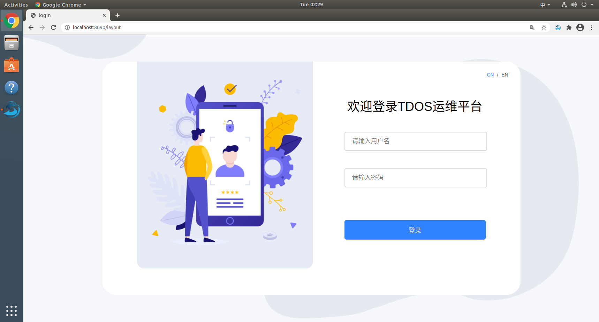
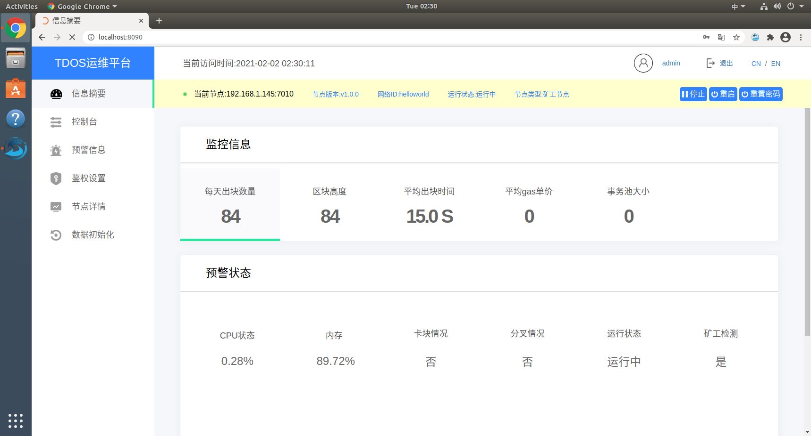
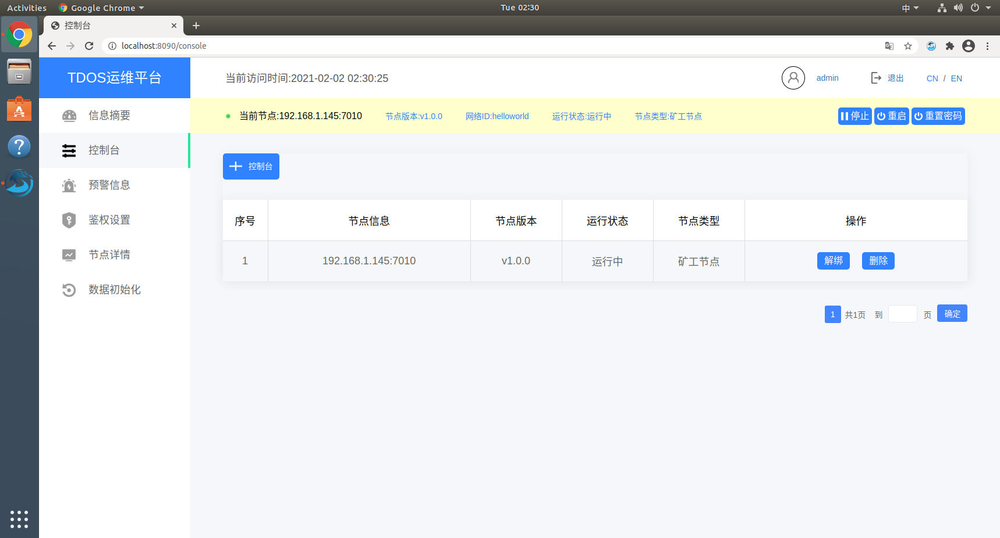
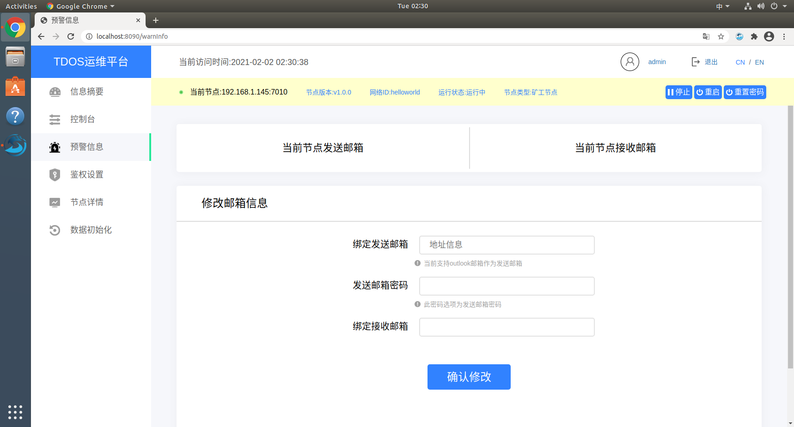
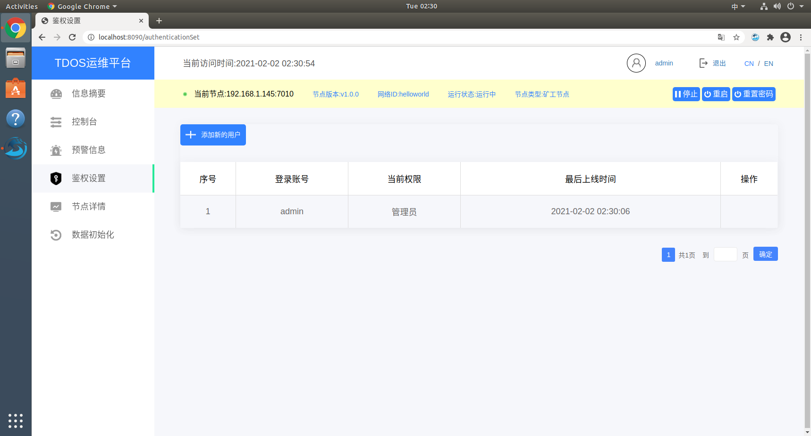
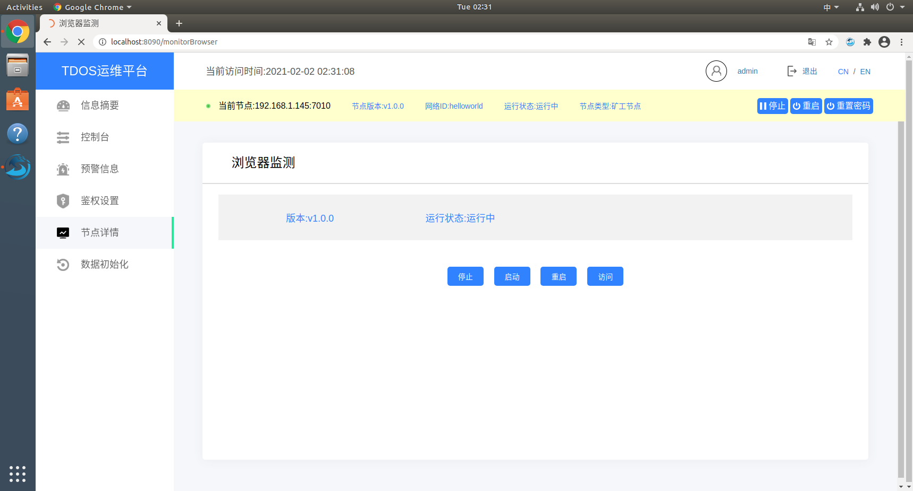
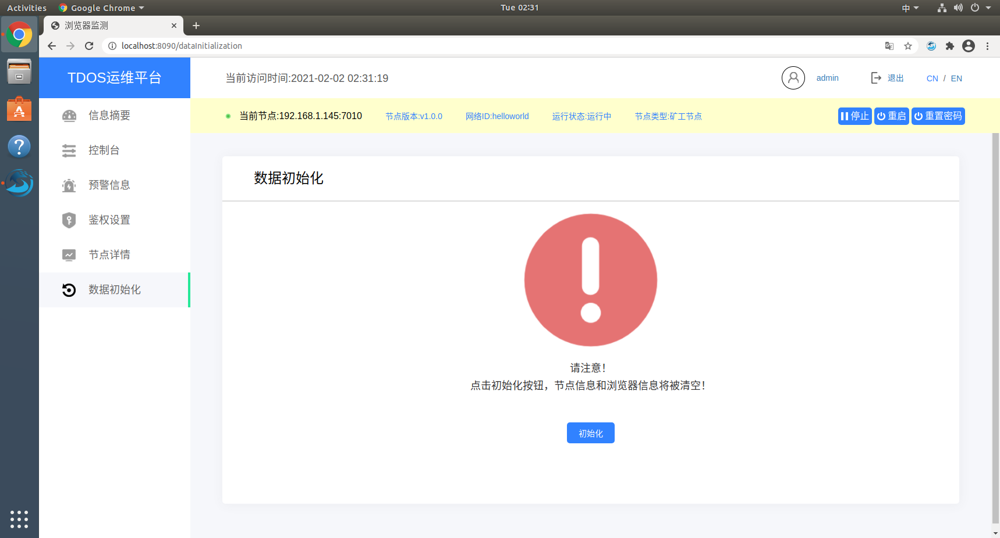

3.1 功能说明

(1)分叉监测

  邻居节点大于等于三个的时候，主节点最新的高度的哈希与邻居节点对应的哈希不一致的数量超过三分之二时就视为分叉。

(2)卡块监测

  实时监测数据同步情况，如果发现长时间停留在一高度，则发送邮件通知出现卡块的情况。

(3)导出功能（暂未开放）

  直接导出通过地址查询的事务数据到Excel。使用了POI对查询的结果进行导出。 导出字节格式数据，并恢复为关系数据。

(4)预警通知

  预警通知是一个可选功能，当监听节点发现出现分叉、节点卡块时会发送邮件通知。使用了Javamail进行邮件的发送。

(5)鉴权设置

 运维工具需要具备用户权限的设置，默认分为管理员、操作员与仅查询3个角色运维工具服务端需要进行身份验证，禁止任意查询。申请登陆账户，需要              通过管理员新增用户申请。管理员可以修改其他用户的权限，操作员权限不可以修改其他用户的权限，仅查询权限只可以进行查询操作。

(6)节点详情

 节点详情实际上是对TDOS浏览器的监测，打开运维工具的时候，TDOS浏览器处于未运行状态，可以对它执行启动、停止、重启和访问操作。

(7)数据初始化

 数据初始化的初衷是防止多次部署TDOS操作系统，节点数据没有清除，部署失败的情况设计的。该功能主要用于清除节点信息、关闭TDOS浏览器、关闭TDOS运维工具。已经部署过一次TDOS操作系统，想要再次部署时需要进行数据初始化。

   

3.2 前端操作

&nbsp;&nbsp;&nbsp;&nbsp;&nbsp;&nbsp;(1)登陆界面，输入用户名密码进行登陆TDOS运维平台

&nbsp;&nbsp;&nbsp;&nbsp;&nbsp;&nbsp;(2)信息概要有监控信息和预警状态两大块，监控信息包含每天出块数量、区块高度、平均出块时间、平均gas单价、事务池大小、当前难度；预警状态包含cpu状态、内存、卡块情况、分叉情况、运行状态、矿工检测

&nbsp;&nbsp;&nbsp;&nbsp;&nbsp;&nbsp;每天出块数量： 本地节点每天出块的数量

&nbsp;&nbsp;&nbsp;&nbsp;&nbsp;&nbsp;区块高度：本地节点当前的区块高度

&nbsp;&nbsp;&nbsp;&nbsp;&nbsp;&nbsp;平均出块时间：所有出块时间的平均值

&nbsp;&nbsp;&nbsp;&nbsp;&nbsp;&nbsp;平均gas单价：所有交易的平均gas单价

&nbsp;&nbsp;&nbsp;&nbsp;&nbsp;&nbsp;事务池大小：待打包事务个数

&nbsp;&nbsp;&nbsp;&nbsp;&nbsp;&nbsp;当前难度：当前共识的难度值

&nbsp;&nbsp;&nbsp;&nbsp;&nbsp;&nbsp;cpu状态：当前节点的cpu状态

&nbsp;&nbsp;&nbsp;&nbsp;&nbsp;&nbsp;内存：当前节点的内存

&nbsp;&nbsp;&nbsp;&nbsp;&nbsp;&nbsp;卡块情况：本地节点长时间停留在同一高度，就显示是，否则显示否，如果用户没有绑定节点，则显示待确认。

&nbsp;&nbsp;&nbsp;&nbsp;&nbsp;&nbsp;分叉情况：检测本地节点是否出现分叉情况，如果分叉，则显示是，没有分叉则显示否，如果用户没有绑定节点，则显示待确认。

&nbsp;&nbsp;&nbsp;&nbsp;&nbsp;&nbsp;运行状态：如果本地节点没有启成功，则显示连接超时，节点启成功，则显示运行中

&nbsp;&nbsp;&nbsp;&nbsp;&nbsp;&nbsp;矿工检测：检测本地节点是否为矿工节点，如果是矿工节点就显示是，如果是全节点就显示否

&nbsp;&nbsp;&nbsp;&nbsp;&nbsp;&nbsp;(3)控制台，管理、绑定节点

&nbsp;&nbsp;&nbsp;&nbsp;&nbsp;&nbsp;控制台可以绑定、解绑和删除节点；

&nbsp;&nbsp;&nbsp;&nbsp;&nbsp;&nbsp;(4)预警信息，管理收、发邮件信息

&nbsp;&nbsp;&nbsp;&nbsp;&nbsp;&nbsp;(5) 鉴权设置，管理用户设置权限

&nbsp;&nbsp;&nbsp;&nbsp;&nbsp;&nbsp;(6) 节点详情

&nbsp;&nbsp;&nbsp;&nbsp;&nbsp;&nbsp;点击访问，访问绑定节点

&nbsp;&nbsp;&nbsp;&nbsp;&nbsp;&nbsp;(7)数据初始化

&nbsp;&nbsp;&nbsp;&nbsp;&nbsp;&nbsp;点击初始化按钮，节点信息和浏览器信息将被清空。成功后运维平台将退出，需要重新部署向导工具。